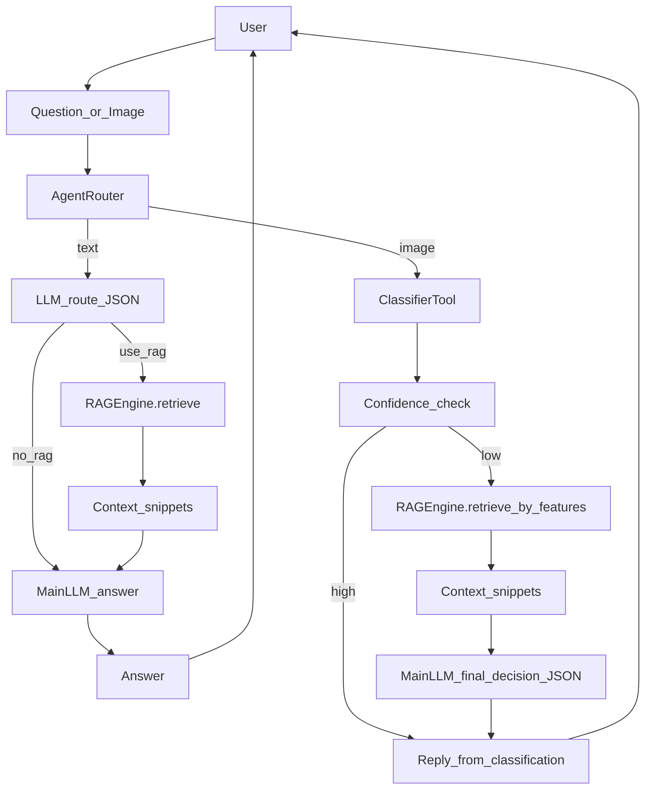

# Parrot-Set RAG（检索增强生成）说明文档

这份文档解释本项目的 RAG（Retrieval-Augmented Generation，检索增强生成）是如何工作的：**知识从哪里来、如何建索引、如何检索、返回结果长什么样、以及它在 Agent 里何时被调用**。

## 一张图看懂（端到端）



## 这套 RAG 解决什么问题？

大模型（LLM）擅长生成，但可能“编造”。RAG 的核心思想是：

- 先从本地知识库里**检索**与问题最相关的资料片段
- 再把这些片段作为“资料”交给 LLM 进行**回答/推理**

这样可以显著降低幻觉，并让回答可追溯到来源文件。

在 Parrot-Set 里，RAG 主要用于：

- **文本问答**：用户问“某种鹦鹉的特征/习性/吃什么/怎么养”，先检索 `knowledge/` 文档，再回答。
- **低置信度识图增强**：当图片识别结果置信度低时，用“候选物种 + 视觉描述”去检索资料，帮助主 LLM 做最终判定。

## 相关代码在哪里？

- **RAG 引擎实现**：`agent/rag.py`
  - `RAGEngine.build_index()`：构建/重建索引
  - `RAGEngine.retrieve()`：检索 top_k 片段
- **旧版分析流水线的检索封装**：`agent/tools/search.py::search_knowledge()`
- **新版通用 Agent 编排**：`agent/router.py`
  - 文本问答：`run_ask()` / `stream_ask_events()`
  - 图片低置信度增强：`run_analyze()` / `stream_analyze_events()`
- **后端知识库管理接口**：`app.py`
  - `POST /knowledge/upload`、`POST /knowledge/reindex`、`GET /knowledge/list`、`DELETE /knowledge/{filename}`

## 知识库从哪里来？支持哪些文件？

默认知识库目录是项目根目录下的 `knowledge/`。

`agent/rag.py::RAGEngine.load_knowledge_base()` 会读取以下类型：

- `.md`
- `.txt`
- `.pdf`
- `.docx`

并且会跳过 `knowledge/README.md`（避免把说明文档当作知识内容索引）。

### 知识库内容建议（写给非算法同学）

RAG 命中好不好，**很大程度取决于文档写法**。推荐结构：

- **标题就是物种/主题名**：例如 `# 玄凤鹦鹉`
- **要点用列表**：例如“特征/习性/饮食/饲养注意”分段
- **少用长段落堆叠**：长段落会被切片拆开，关键信息可能分散在多个 chunk

## 建索引做了什么？（build_index）

### 1) 读取文档并做变更检测

为了避免每次启动都全量重建，RAG 使用“变更检测”：

- 对每个知识文件算一个 `md5`（文件内容 hash）
- 汇总成 `kb_hash`
- 将 `kb_hash` 存到 `data/chroma_db/kb_metadata.json`

当 `kb_hash` 未变化且 ChromaDB 里已有数据时，会直接复用已有索引。

### 2) 文本切片（chunk）

因为全文可能很长，检索会按“片段”进行。本项目支持两类切片策略（见 `agent/rag.py::chunk_text()`）：

#### A) 固定长度切片（fixed）

- **做法**：按固定字符窗口滑动切分（适合任意纯文本）
- **优点**：实现简单、稳定、对格式不敏感
- **缺点**：可能把一个段落/标题切开，语义完整性略差

#### B) 语义切片（semantic）

- **做法**：先按“标题/段落”切成语义单元（units），再把多个 unit 合并到目标长度附近
- **优点**：更适合 markdown/结构化知识库，命中片段更完整
- **缺点**：依赖文本结构（标题/空行）质量；对“糊成一坨”的文档收益较低

#### Overlap（重叠）

无论哪种策略，都支持 overlap：相邻 chunk 之间会保留一段重叠内容，避免关键信息恰好切在边界处。

切片后的每个片段都会写入向量库，并带上元数据：

- `source`：文件名
- `chunk_index`：第几个片段
- `total_chunks`：该文件总片段数

### 3) 向量化（Embedding）

本项目默认使用 Qwen Embedding 模型：

- `Qwen/Qwen3-Embedding-0.6B`

实现位于 `agent/rag.py::QwenEmbeddingFunction`，它会：

- 懒加载 tokenizer + model（第一次调用才加载）
- 在 CPU / CUDA 上生成 embedding（默认：有 CUDA 用 CUDA）
- 做归一化（cosine 检索）

### 4) 存入 ChromaDB（持久化）

向量库使用 ChromaDB 的持久化 client：

- 路径：`data/chroma_db`
- collection 名称：`parrot_knowledge`
- 相似度空间：cosine（`hnsw:space=cosine`）

这意味着索引会落盘，重启服务不会丢失（只要目录存在且可写）。

### 索引文件会存在哪？里面有什么？

默认目录：`data/chroma_db/`（可理解为“向量索引数据库目录”）。通常你会看到：

- `chroma.sqlite3`：Chroma 的元数据/索引信息（持久化）
- `kb_metadata.json`：我们额外写入的知识库 hash，用于判断是否需要重建索引

## 检索怎么做？（retrieve）

核心入口：`agent/rag.py::RAGEngine.retrieve(query, top_k=3)`

步骤：

1. 如果 collection 为空，会自动触发 `build_index()`（首次可能较慢）
2. 把 query 包装成“带任务指令的 query”（`get_detailed_instruct`）
3. **粗排（向量检索）**：调 `collection.query(..., n_results=coarse_k)`（默认 coarse_k=10，且 `coarse_k >= top_k`）
4. **精排（Rerank）**：对粗排候选用 `bge-reranker`（CrossEncoder）重打分，按 rerank 分数排序后截断为 `top_k`
5. 将 Chroma 返回的 `distance` 转成向量相似度（用于回溯/阈值过滤）：
   - `vector_score = 1 - distance`

返回结构（list）：

- `content`：命中文本片段
- `score`：最终排序分数（启用 rerank 时为 `rerank_score`；否则退回 `vector_score`）
- `rerank_score`：精排分数（raw score，尺度不一定是 0~1，仅用于相对排序）
- `vector_score`：向量粗排分数（`1-distance`，尺度通常在 0~1）
- `source`：来源文件名
- `chunk_info`：切片元数据（chunk_index/total_chunks 等）

### score（相似度）怎么理解？

本项目返回的 `score` **可能是两种口径**：

- 未启用 rerank：`score = vector_score = 1 - distance`
- 启用 rerank：`score = rerank_score`（CrossEncoder raw score，用于排序；不要直接拿它做 0~1 的阈值）

其中向量分数 `vector_score` 是：

\[ vector\_score = 1 - distance \]

其中 `distance` 来自 Chroma 的向量距离（cosine space），因此：

- `vector_score` 越接近 1，表示越相似
- `vector_score` 越接近 0，表示越不相似

注意：不同模型/不同知识库规模下，分数绝对值不可直接横向比较。

在旧版封装 `agent/tools/search.py` 里，有一个经验阈值过滤；在启用 rerank 后它会优先使用 `vector_score` 做阈值（避免 rerank 分数尺度差异）。

## RAG 在 Agent 中什么时候会被调用？

### A) 文本问答（Agent 自主决定是否用 RAG）

在 `agent/router.py`：

- 先用 LLM 路由器判断 `use_rag` 和 `search_query`（并有关键词兜底）
- 若 `use_rag=true`，才调用 `RAGEngine.retrieve(search_query, top_k)`
- 命中的片段会拼成 `资料：...` 放入 prompt，让主 LLM 生成最终回答

### B) 图片低置信度增强

在 `agent/router.py`：

- 先 `ClassifierTool` 输出候选/置信度/视觉描述
- 若置信度低（Low 或 score 低于阈值），构造 queries：
  - 候选对比
  - 视觉描述反推
  - top1 特征确认
- 对每条 query 调 `RAGEngine.retrieve(..., top_k=2)` 收集片段
- 将片段作为“资料”交给主 LLM 输出最终判定 JSON

## 知识库管理（后端 API）

你可以通过后端接口动态管理 `knowledge/`：

- `POST /knowledge/upload`：上传 `.md/.txt/.pdf/.docx`，保存到 `knowledge/` 并触发重建索引
- `POST /knowledge/reindex`：强制重建索引
- `GET /knowledge/list`：列出知识库文档
- `DELETE /knowledge/{filename}`：删除文档并重建索引

## 常见问题与排错

### 1) 第一次检索很慢

首次检索会触发：

- 加载 Embedding 模型
- 读取并切片所有文档
- 写入 ChromaDB

这是正常现象。后续会复用索引，速度会明显提升。

### 1.1) 如何“预热”索引（推荐做法）

如果你不希望第一次问答卡顿，可以：

- 启动后端后调用一次 `POST /knowledge/reindex`（强制重建）
- 或者在启动脚本里调用一次 `rag.build_index()`（可选）

### 2) 检索命中不准

常见原因：

- 知识库文档内容太短/结构混乱（建议用标题 + 要点列表）
- 文档数量太少
- Query 构造不够精确（可在 `agent/router.py` 调整 `search_query` 生成策略）

### 3) 索引没有更新

当你直接修改 `knowledge/` 文件后：

- 正常情况下 hash 变化会触发重建
- 如果怀疑未更新，调用 `POST /knowledge/reindex` 强制重建即可

### 4) Windows 环境 torch/transformers 加载失败

RAG 的 embedding 依赖 `torch` + `transformers`。如果出现 DLL 初始化失败等问题，需要检查：

- Python 环境是否一致（不要混用 Anaconda 与 venv）
- `torch` 安装是否匹配 CUDA/CPU

## 如何调参（开发者）

常见可调参数（目前写在代码中，可按需抽到 config）：

- `chunk_text(chunk_size=500, overlap=80, strategy=\"semantic\")`：片段大小/重叠/策略（当前 build_index 默认使用这一套）
- `RAGEngine.retrieve(top_k=3)`：每次返回片段数
- `RAGEngine(enable_rerank=True, rerank_model_name=\"BAAI/bge-reranker-base\", rerank_device=\"cpu\", rerank_coarse_k=10)`：粗排+精排参数
- `QwenEmbeddingFunction(model_name=...)`：embedding 模型
- ChromaDB 路径：`cache_dir="data/chroma_db"`

## 端到端示例（给开发者/调试）

### 1) 通过后端接口上传文档并重建索引

```bash
curl -X POST -F \"file=@knowledge/玄凤鹦鹉.md\" http://localhost:8000/knowledge/upload
curl -X POST http://localhost:8000/knowledge/reindex
```

### 2) 用文本问答触发 RAG

```bash
curl -X POST http://localhost:8000/ask -H \"Content-Type: application/json\" -d \"{\\\"question\\\":\\\"玄凤鹦鹉的典型特征是什么？\\\",\\\"top_k\\\":3}\"
```

### 3) 在通用 Agent 中触发（由 Agent 决定是否用 RAG）

```bash
curl -X POST -F \"message=玄凤鹦鹉的饮食是什么？\" http://localhost:8000/agent/message
```


