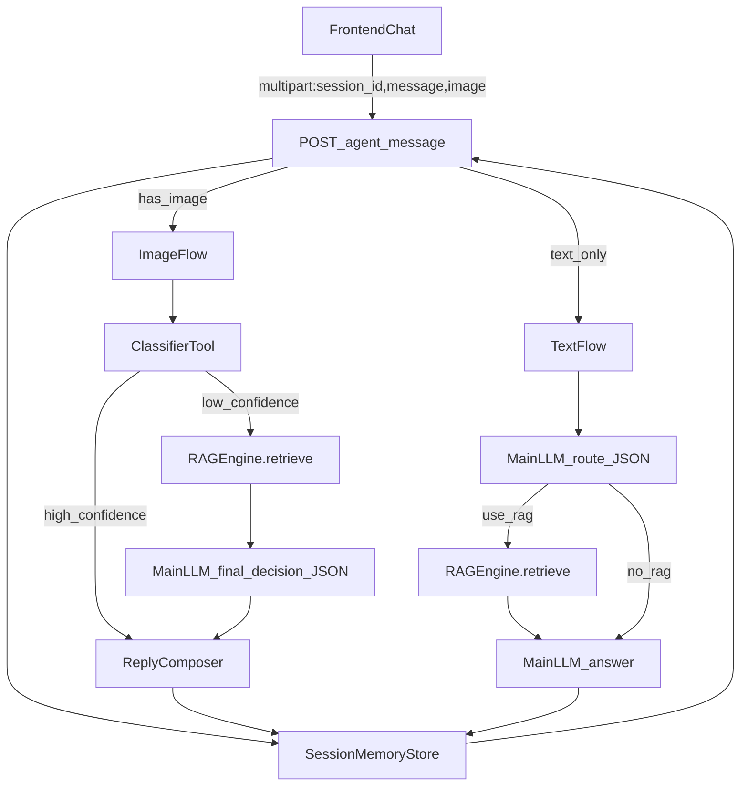

# Parrot Set Agent 模块（智能核心）

`agent/` 是 Parrot Set 的“智能中枢”，将 **多模态识图**、**知识库检索（RAG）**、**主 LLM 推理/回答**、以及 **会话记忆** 组合成一个可扩展的“通用 Agent”，并通过后端 API（`app.py`）对外提供统一交互入口。

## Agent 能做什么？

- **统一对话入口（推荐）**：`POST /agent/message` 统一接收文本/图片，Agent 自动决定执行路径（识图、问答、提示补充信息），并返回 `session_id` 支持多轮追问。
- **图片识别（视觉工具）**：输入图片 → 输出候选物种（Top-K）、概率、视觉特征描述、置信度等级、判定依据。
- **低置信度“检索增强判定”**：当识图置信度低时，Agent 会基于“候选 + 视觉特征”检索资料，并把资料交给主 LLM 做最终判定（或提示需要补拍角度）。
- **文本问答（Agent 自主决定是否用 RAG）**：对于文本问题，Agent 会自行决定是否检索知识库；检索时会生成更合适的 `search_query`。
- **结构化结果对齐数据库**：候选物种会尝试与本地 `parrot_db` 匹配，补全英文名/学名/科目/链接等信息（若存在记录）。

## 核心数据流（与当前实现一致）

### 1) 统一入口 `/agent/message`（推荐使用）



### 2) 图片识别：低置信度触发 RAG + 主 LLM 终判

实现位置：`agent/router.py::AgentRouter.run_analyze()`

- **Step A**：调用视觉模型（`agent/tools/classifier.py::ClassifierTool`）得到：
  - `top_candidates`（包含 `name/score/probability`）
  - `visual_features_description`
  - `confidence_level`（High/Medium/Low）
  - `explanation`
- **Step B（决策）**：如果置信度不足（例如 `confidence_level=Low` 或 `top_score` 低于阈值），触发检索：
  - 用“候选名 + 视觉描述”构造查询
  - `agent/rag.py::RAGEngine.retrieve()` 返回若干片段
- **Step C（终判）**：把“候选+视觉描述+检索资料”交给主 LLM，要求输出 JSON：
  - `final_name`：最终判定物种名或“无法确定”
  - `reasoning`：简要依据
  - `need_more_info/followup`：不确定时建议补拍的角度/信息

#### 低置信度判定阈值（当前写死在代码中）

实现位置：`agent/router.py::_confidence_is_low()`

- `confidence_level == "Low"`：一定触发 RAG
- `confidence_level == "Medium"`：当 `top_score < 0.65` 触发 RAG
- `confidence_level == "High"`：不触发 RAG
- 若 `confidence_level` 缺失：当 `top_score` 缺失或 `top_score < 0.75` 触发 RAG

> 说明：`top_score` 来自视觉模型输出的 `score (0~1)`；`probability` 是 `score*100` 的展示值（见 `agent/tools/classifier.py`）。

#### RAG 查询构造（低置信度时）

实现位置：`agent/router.py::AgentRouter.run_analyze()`

最多构造 3 条 query（每条取 `top_k=2`），并做去重：

- 候选对比：`"{cand1}/{cand2}/{cand3} 这些鹦鹉的区别与识别要点是什么？"`
- 视觉描述反推：`"根据描述：{visual_features_description}。这更可能是哪种鹦鹉？请给出判断依据。"`
- Top1 物种确认：`"{top1_name} 的典型外观特征是什么？"`

### 3) 文本问答：混合路由（LLM few-shot + 关键词兜底）

实现位置：`agent/router.py::AgentRouter.decide_text_routing()` + `agent/router.py::AgentRouter.run_ask()`

- **LLM few-shot 路由**：给定样例，让主 LLM 输出 JSON：
  - `is_followup`: 是否在追问上一只识别对象
  - `use_rag`: 是否需要 RAG
  - `search_query`: 适合检索的短 query
- **兜底规则**：当 LLM 输出不可解析或失败时，回退到关键词规则：
  - `FOLLOWUP_MARKERS` / `NEED_IMAGE_MARKERS` / `FACTUAL_MARKERS`

#### 文本路由协议（LLM 输出 JSON）

实现位置：`agent/router.py::ROUTE_FEWSHOT` + `agent/router.py::AgentRouter.decide_text_routing()`

路由器必须只输出一个 JSON：

```json
{
  "is_followup": true,
  "use_rag": true,
  "search_query": "玄凤鹦鹉 吃什么 饮食"
}
```

- `is_followup`：是否是在“追问上一只识别对象/上下文对象”
- `use_rag`：是否需要检索知识库再答
- `search_query`：检索 query（为空则由代码回退为默认 query）

#### 兜底关键词（当 LLM 路由失败时）

实现位置：`agent/router.py` 顶部常量：

- `FOLLOWUP_MARKERS`：追问标记词（如“刚才/这只/它/上一只/那个”）
- `NEED_IMAGE_MARKERS`：识别诉求标记词（如“识别/分类/这是什么鸟”）
- `FACTUAL_MARKERS`：事实型问答标记词（如“特征/习性/分布/吃什么/怎么养”等）

## 目录结构

```text
agent/
├── __init__.py
├── config.py                 # 读取/合并 config.json 的 agent_settings（含向后兼容映射）
├── core.py                   # AgentService：初始化主 LLM + 工具（ClassifierTool）
├── llm.py                    # OllamaLLM：对接本地 Ollama /api/chat（支持图片）
├── memory.py                 # SessionMemoryStore：会话存储（TTL + 历史裁剪）
├── models.py                 # Pydantic：ClassificationResult / AnalyzeResult 等
├── rag.py                    # RAGEngine：ChromaDB 持久化 + Qwen Embedding
├── router.py                 # AgentRouter：规则+LLM混合路由、低置信度检索增强判定
└── tools/
    ├── classifier.py         # 视觉分类工具：识别 + 特征抽取 + 解释 + 置信等级
    ├── search.py             # RAG 检索封装（部分路径仍可复用）
    └── import_knowledge.py   # 预留（当前为空）
```

## 目录结构

```text
agent/
├── __init__.py
├── config.py                 # 读取/合并 config.json 的 agent_settings
├── core.py                   # AgentService（编排入口）：classify / analyze
├── llm.py                    # OllamaLLM：对接本地 Ollama /api/chat（支持图片）
├── models.py                 # Pydantic 输出模型：ClassificationResult / AnalyzeResult
├── rag.py                    # RAGEngine：ChromaDB 持久化 + Qwen Embedding
└── tools/
    ├── classifier.py         # 视觉分类工具：识别 + 特征抽取 + 解释
    ├── search.py             # 基于候选物种名的 RAG 检索封装
    └── import_knowledge.py   # 预留（当前为空）
```

## API/协议（更偏工程视角）

### `POST /agent/message`（统一入口）

- **请求类型**：`multipart/form-data`
- **字段**：
  - `session_id`（可选）：会话 ID；不传则服务端创建新会话并在响应返回
  - `message`（可选）：文本消息
  - `image`（可选）：图片文件

#### 返回（核心字段）

- `session_id`：会话 ID
- `mode`：`analyze` / `ask` / `prompt`
- `reply`：给用户看的回复文本
- `artifacts`：结构化产物（可能较大）
- `debug`：调试信息（高信号、小体积）

#### 返回 artifacts 约定

- `mode=analyze`：
  - `classification`：视觉模型输出（候选/特征/解释/置信度等）
  - `rag_hits`：低置信度时的检索命中（未触发则为空数组）
  - `decision`：终判 JSON（`final_name/reasoning/need_more_info/followup/used_rag`）
- `mode=ask`：
  - `hits`：RAG 命中片段（若 `rag_used=false` 可能为空）
  - `rag_used`：本次是否启用检索
  - `rag_query`：最终用于检索的 query（LLM 决策或 fallback）

#### debug 字段（当前实现）

实现位置：`app.py::agent_message()`

- `used_species_hint`：本次问答是否绑定了 `last_species`
- `last_species`：会话里记录的最近识别物种
- `session_count`：当前进程内会话数量（用于观测 TTL 是否生效）
- `history_len`：本会话历史消息条数（裁剪后）
- `hit_sources`：本次问答命中的 source 列表（若走 ask）
- `analyze_summary`：识图摘要（Top1 + 命中来源等，若走 analyze）

### `POST /classify`（仅识图）

直接调用视觉工具，返回 `ClassificationResult`（见 `agent/models.py`）。

### `POST /analyze`（旧接口，仍保留）

`/analyze` 走 `agent/core.py::AgentService.analyze()`：分类后调用 `agent/tools/search.py::search_knowledge()` 做检索。\n+它与 `/agent/message` 的图片流程不同：`/agent/message` 会在低置信度时做“RAG + LLM 终判”，更偏通用 Agent 行为。

### `POST /ask`（文本问答）

当前实现复用 `agent/router.py::AgentRouter.run_ask()`：由 Agent 决定是否检索，再用主 LLM 生成回答。

## 运行前置条件

- **Python 依赖**：安装项目根目录 `requirements.txt`
- **Ollama 本地服务**：默认使用 `http://127.0.0.1:11434`
- **模型准备**：需要一个可处理图片的多模态模型（例如 `qwen3-vl:*`）。

（如果 `/health` 返回 `ollama_available: false`，说明 Ollama 没启动或端口不可达。）

## 快速开始（开发者）

在项目根目录：

```bash
pip install -r requirements.txt
python app.py
```

然后调用 API（推荐顺序）：

- `POST /agent/message`：统一入口（文本/图片/会话），返回 `session_id/mode/reply/artifacts/debug`
- `POST /classify`：仅做图片分类（直接返回 `ClassificationResult`）
- `POST /analyze`：旧流程接口（分类 + 知识检索），仍保留可用
- `POST /ask`：纯文本问答（内部复用 `AgentRouter.run_ask`）

## 配置说明（config.json → agent_settings）

`agent/config.py` 会读取项目根目录 `config.json` 的 `agent_settings` 并与默认值合并。

### 关键字段

- **main_model**：Agent 主模型名（当前主要用于预留/扩展；分类由 classifier 工具模型负责）
- **main_temperature**：主模型温度
- **tools.classifier.model_name**：视觉模型（必须支持图片输入）
- **tools.classifier.temperature**：分类温度

### 向后兼容

仓库现有配置里用的是：`default_model/default_temperature`。现在也支持，启动时会自动映射为 `main_model/main_temperature`。

### 示例

```json
{
  "agent_settings": {
    "main_model": "qwen2.5:7b-instruct",
    "main_temperature": 0.5,
    "tools": {
      "classifier": {
        "model_name": "qwen3-vl:2b-instruct-q4_K_M",
        "temperature": 0.1
      }
    }
  }
}
```

## RAG（知识库检索）如何工作？

- **知识来源**：默认读取项目根目录 `knowledge/` 下的 `.md/.txt/.pdf/.docx`（忽略 `knowledge/README.md`）。
- **向量库**：使用 `data/chroma_db` 持久化（ChromaDB）。
- **Embedding**：`Qwen/Qwen3-Embedding-0.6B`（默认），会按需加载到 CPU 或 CUDA。
- **触发重建**：知识文件变化（hash）或显式 `force_rebuild=True` 时重建索引。

你也可以通过后端 API 管理知识库：

- `POST /knowledge/upload`：上传文档，保存到 `knowledge/` 并触发重建索引
- `GET /knowledge/list`：列出知识库文档
- `DELETE /knowledge/{filename}`：删除文档并重建索引
- `POST /knowledge/reindex`：强制重建索引

## `/agent/message` 返回字段说明（用于调试/可视化）

- `session_id`：后端会话 ID（前端应保存并在后续请求带上）
- `mode`：本次路由结果：`analyze` / `ask` / `prompt`
- `reply`：面向用户的自然语言回复
- `artifacts`：结构化“中间产物”，用于 UI 展示或后续追问（可能较大）
  - `mode=analyze` 常见包含：
    - `classification`：识图结构化结果（候选/特征/置信度/解释等）
    - `rag_hits`：低置信度时检索命中片段（若未触发则可能为空）
    - `decision`：主 LLM 终判 JSON（含 `final_name/reasoning/need_more_info/followup/used_rag`）
  - `mode=ask` 常见包含：
    - `hits`：RAG 命中片段（若 `rag_used=false` 可能为空）
    - `rag_used` / `rag_query`：本次是否使用检索及使用的 query
- `debug`：高信号调试信息（避免返回过大内容），例如：命中来源、会话长度、是否使用物种提示等

## 会话记忆（SessionMemoryStore）的限制

- 当前实现为**进程内内存**（`agent/memory.py`），重启会丢失；多 worker（多进程）不共享。
- 若需要生产可用的持久会话，建议替换为 Redis 等外部存储。

#### 当前会话参数（写死在后端）

实现位置：`app.py` 初始化处

- `ttl_seconds = 3600`：会话 1 小时不活跃会过期
- `max_turns = 10`：最多保留 10 轮（内部按 message 计数，约等于 20 条记录上限）

## 工程排错（常见坑）

### 1) Windows 控制台中文乱码

如果你在 Windows 终端里用 `python -c ... print(json.dumps(..., ensure_ascii=False))`，可能会遇到 `gbk` 编码报错或乱码。\n+建议改用：\n+\n+- PowerShell 设置 UTF-8：`$OutputEncoding = [Console]::OutputEncoding = [Text.UTF8Encoding]::new()`\n+- 或在命令前设置：`set PYTHONIOENCODING=utf-8`（cmd）/ `$env:PYTHONIOENCODING='utf-8'`（PowerShell）\n+\n+这不影响服务端返回内容，只影响终端显示。

### 2) LLM 路由/终判 JSON 解析失败

`agent/router.py::_safe_json_extract()` 只会截取第一个 `{` 到最后一个 `}` 之间的内容并尝试 `json.loads()`。\n+如果模型输出夹杂了其它文字，会导致解析失败并触发兜底路径。

### 3) RAG 命中质量不稳定

RAG 依赖 `knowledge/` 文档内容、Embedding 模型、以及索引状态。可通过：\n+\n+- `POST /knowledge/reindex` 强制重建索引\n+- 检查 `data/chroma_db` 是否可写\n+- 增加更“结构化”的知识文档（标题明确、要点列表）

## 扩展建议（如何加新能力）

当前 `AgentService` 的模式是：**工具产出结构化结果 → 统一编排 → 对外提供 API**。

如果要添加新能力（例如“基于候选物种生成饲养建议”）：

1. 在 `agent/tools/` 新增工具文件（例如 `care_advice.py`）
2. 在 `agent/config.py` 的 `DEFAULT_AGENT_CONFIG["tools"]` 中为该工具加默认配置
3. 在 `agent/router.py` 中把新工具纳入路由与编排（例如：在特定意图下调用）
4. 在 `app.py` 的 `/agent/message` 中返回新工具的 `artifacts`（便于前端展示）
